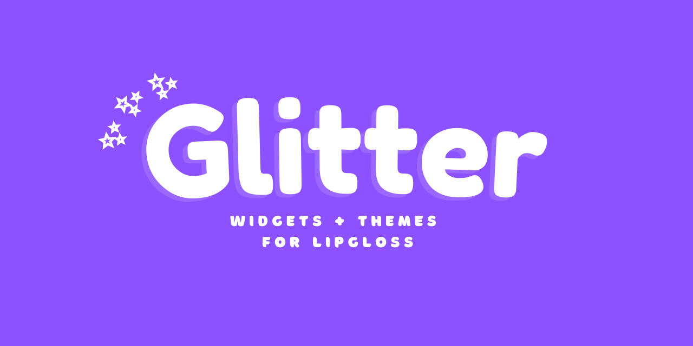
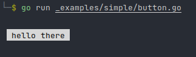
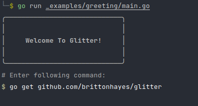

# ✨ Glitter ✨

> UI components + themes for [lipgloss](https://github.com/charmbracelet/lipgloss), 
> [glamour](https://github.com/charmbracelet/glamour), and [bubbletea](https://github.com/charmbracelet/bubbletea)

<br>


## Usage

```shell
go get github.com/brittonhayes/glitter
```

View all the examples in [here](./_examples/)

### Button

Let's create a simple button with the Gruvbox theme.

```go
func main() {
    // Create a new glitter UI and select a theme
    ui := glitter.NewUI(theme.Gruvbox)
    
    // Create a button and mark it as active
    btn := ui.Button("hello there", true)
    
    // Render the button!
    fmt.Println(btn)
}
```



### Banner

Now let's use a few different components together
to make a tutorial screen.



```go
func main() {
	ui := glitter.NewUI(theme.Gruvbox)

	var (
		banner         = ui.Banner("Welcome to Glitter!")
		comment        = ui.Comment("#", "Enter following command:")
		prefix, prompt = ui.Prompt("$", "go get github.com/brittonhayes/glitter", false)
	)

	// Print the banner
	fmt.Println(banner.String())

	// Print the code comment
	fmt.Println(comment.String())

	// Print the shell prompt
	fmt.Println(prefix.String(), prompt.String())
}
```

